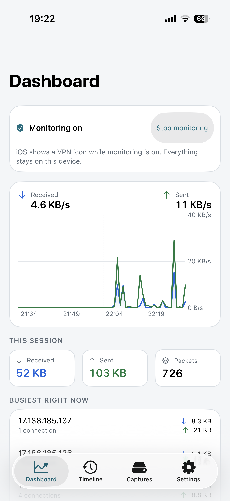
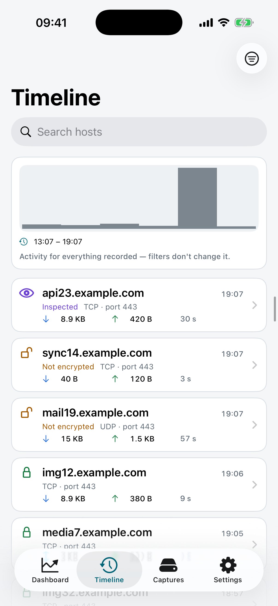
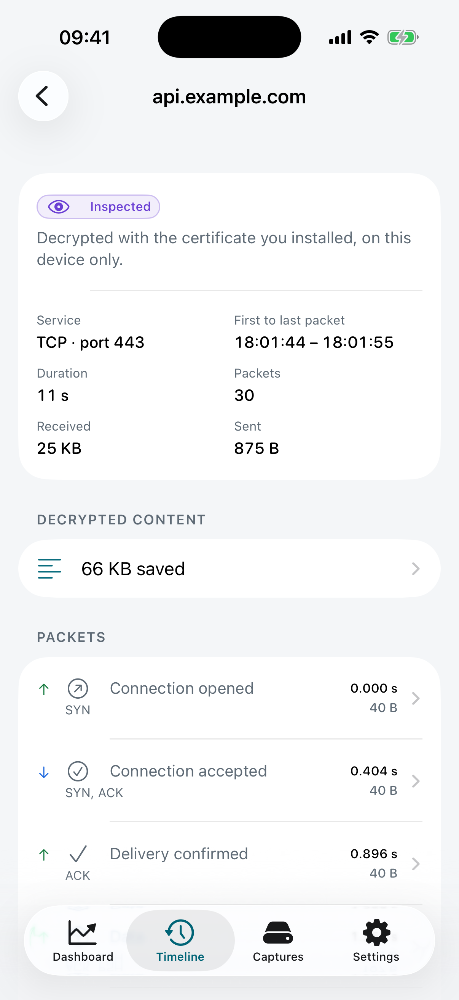
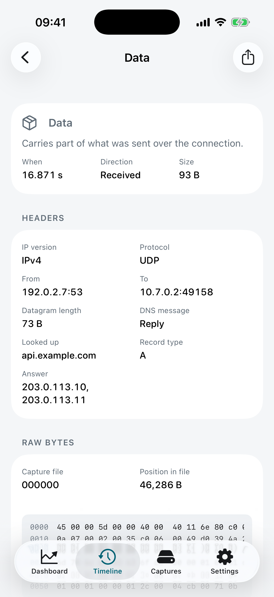
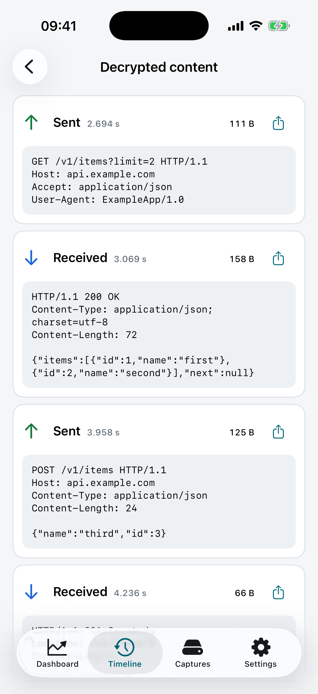
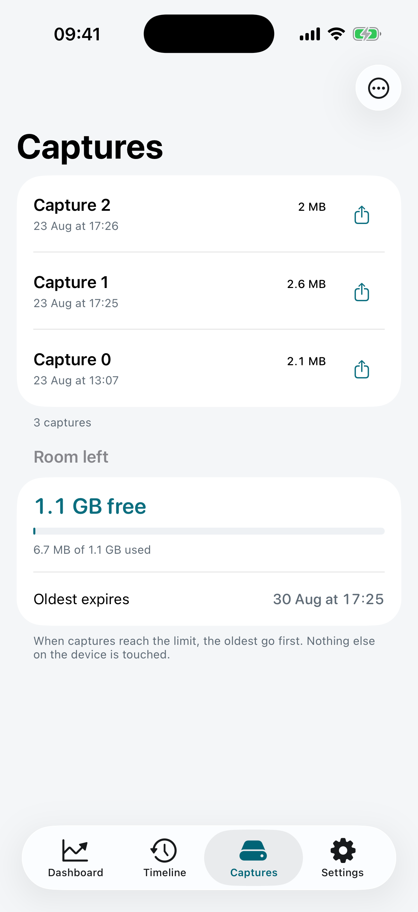
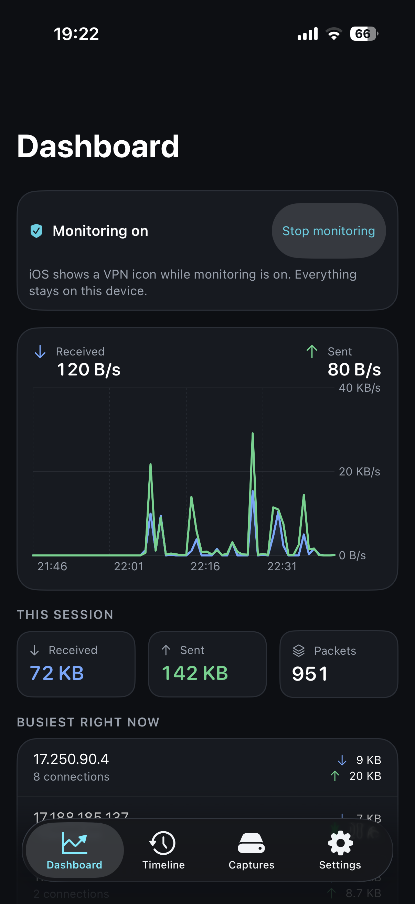

# TunnelVision

**See exactly what your iPhone is talking to — a network monitor that runs entirely on your device. No jailbreak, no computer, nothing ever leaves your phone.**

TunnelVision shows you every connection your iPhone makes: which apps reach which servers, on what ports, and how much data they move — live, as it happens. You can follow a connection all the way down to the individual packets and their raw bytes, and save any capture as a standard `.pcap` file. All of it happens on the device; there is no server behind TunnelVision and no account to create.

> ### Not on the App Store
>
> TunnelVision was finished, submitted, and reviewed on 28 August 2026 — and rejected under
> **Guideline 5.4**, which requires that any app shipping a packet tunnel come from a developer
> account registered to a *company*, not an individual. Nothing was found wrong with the app: not
> its privacy, not its behaviour, not its design. Capturing traffic on iOS is only possible through
> `NEPacketTunnelProvider`, and shipping one makes you a "VPN app" in Apple's classification even
> when, as here, the tunnel ends on your own phone and there is no server anywhere.
>
> So it is published here instead, under the MIT licence, in full. You can read exactly how it
> handles your data, and you can [build it and run it yourself](docs/BUILDING.md). The whole story
> is in [**docs/APP-STORE.md**](docs/APP-STORE.md).

## See it

|  |  |  |
|:--:|:--:|:--:|
| **Live traffic**, in and out, and who is talking most right now | **Your history**, newest first, and whether each connection was encrypted | **One connection**, packet by packet |

|  |  |  |
|:--:|:--:|:--:|
| **One packet**, headers decoded — here a DNS reply, with the name looked up and the answer | **Inside your own HTTPS**, turn by turn, when you switch it on | **Your capture files**, and whether they are going to fill your phone |

TunnelVision follows the system appearance, so all of it comes in dark too:



## Your privacy comes first

TunnelVision is built to inspect **your own** traffic, and its design deliberately stops there:

- **Nothing leaves your device.** All capture, storage, and analysis stay in the app. There is no cloud, no account, and no upload — TunnelVision has no server to send anything to. The only time a file of yours can leave is when *you* share a capture, and the app tells you what is inside it before the share sheet opens.
- **You are always in control.** Monitoring only runs while you have the tunnel switched on, and iOS shows the standard VPN indicator the whole time.
- **Looking inside HTTPS is opt-in.** Reading encrypted traffic is off by default. Turning it on requires *you* to install a certificate on your device — a deliberate, reversible step, guided screen by screen inside the app, and undoable from the same place.
- **It won't break other apps.** Apps that pin their certificates simply stay private and are shown as *not inspectable*. TunnelVision respects other apps' security and never tries to defeat it.

Every one of those claims is now checkable rather than merely stated: the capture path, the storage, and the complete absence of any client that talks to a server of ours are all in this repository.

## What you can do with it

- **Watch traffic live.** Real-time throughput in and out, the hosts talking the most right now, and how many connections are active this session.
- **Scroll through your history.** Every connection, newest first, with the host, ports, data moved, duration, and whether it was plaintext, encrypted, inspected, or not inspectable. Filter by host, protocol, encryption status, or time range.
- **Jump to a moment.** A time axis above the history shows activity interval by interval; tap one to narrow the list to it, and keep tapping to zoom in.
- **Open a connection.** Every packet it carried, titled by what it meant for the connection — opened, accepted, data, delivery confirmed, finished, cut off — with the timing of each one relative to the connection's first packet.
- **Read a single packet.** Its headers, decoded into plain terms (endpoints, protocol, sequence and acknowledgment numbers, window), plus the raw bytes as hex and ASCII, ready to copy or share. For a DNS lookup it goes one layer further and tells you the name that was queried and what answered.
- **Look inside your own HTTPS.** Optional, off by default, and yours to switch on: a connection you inspected shows the exchange decoded, turn by turn. Apps that pin their certificates stay private.
- **Export for later.** Save any capture as a standard `.pcap` file to open in Wireshark or `tcpdump`, or export your connection list as JSON.
- **Keep storage in check.** Set how long history is kept and how large captures may grow; the limits are enforced while monitoring runs, not only while you are looking. The captures list tells you the room left against those limits and when the oldest one expires.

## Getting it on your phone

Since there is no App Store listing, you build it yourself. [**docs/BUILDING.md**](docs/BUILDING.md) is the full guide; the shape of it:

```bash
git clone https://github.com/juanmmm21/TunnelVision.git
cd TunnelVision
Tools/set-bundle-prefix.sh com.yourname   # the bundle IDs here belong to another account
export DEVELOPMENT_TEAM=YOURTEAMID
xcodegen generate && open TunnelVision.xcodeproj
```

Be aware of one real cost before you start: **the packet tunnel needs a paid Apple Developer Program membership**. The Network Extension entitlement cannot be provisioned by a free personal team — that is Apple's constraint, not ours. A free Apple ID is enough to read the code and run the full test suite in the Simulator, but not to run the tunnel on a device.

## How to use it

1. **Start monitoring.** Open TunnelVision — a short introduction explains what it does and what it will ask for — and tap *Start monitoring*. iOS will ask you to allow a VPN configuration; this is how on-device traffic monitoring works on iPhone, and it stays entirely local. The dashboard starts filling in immediately.
2. **Explore.** Watch the live throughput, scroll the timeline, and tap any connection to open it, then any packet to see its bytes.
3. **Look inside HTTPS (optional).** Go to *Settings → set up secure traffic inspection*. The app generates a certificate, hands you the profile, and walks you step by step through installing it and enabling trust in **Settings → General → VPN & Device Management** and **Certificate Trust Settings** — telling you in advance about the warnings iOS will show. Apps that pin their certificates stay private.
4. **Export.** Share a capture as `.pcap` from *Captures*, or export your connection list as JSON — you see how much it contains before anything is shared.

You can stop monitoring at any time, and you can regenerate or remove the inspection certificate from inside the app or from iOS Settings whenever you like.

## What you need

- An **iPhone running iOS 17 or later**. (iPad is not supported: every screen was designed and measured for the phone, and shipping an iPad layout nobody has looked at would be worse than not offering one.)
- A **Mac with Xcode 16+** and a **paid Apple Developer account**, to build and install it.
- Looking inside HTTPS additionally asks you to install a certificate profile — an in-app, guided, fully reversible step.

## How it works

TunnelVision uses Apple's built-in **NetworkExtension** framework to run a small, *local* VPN — one that ends on your own phone instead of forwarding to a company's server somewhere. Your traffic passes through it, TunnelVision records what it sees, and the traffic continues to the internet unchanged. Latency-sensitive traffic such as calls and video streaming is passed straight through so your phone stays fast and your battery is spared.

The interesting engineering is in doing that inside the envelope iOS gives a network extension:

- **A userspace TCP/IP path.** The extension only ever sees raw IP datagrams. To read or terminate a TCP stream you have to reassemble it yourself — sequence-number ordering, retransmits, out-of-order segments — in a userspace flow table, and then terminate connections in a userspace stack when inspection is on.
- **A hard memory ceiling.** Network extensions run in a separate process with a small memory budget. Buffers are bounded, captures stream straight to disk as `pcap`, and back-pressure drops rather than grows.
- **Cheap IPC to the UI.** The extension and the app are different processes. Packet metadata reaches the UI through a bounded ring buffer in a memory-mapped file in the shared App Group container, with a Darwin notification used only as a "data available" wakeup — never as a data channel.
- **Throughput-first persistence.** History goes to SQLite (via GRDB) rather than Core Data or SwiftData, because the write pattern is thousands of small append-only rows per second.

[`docs/ARCHITECTURE.md`](docs/ARCHITECTURE.md) covers the whole picture, [`docs/spec/`](docs/spec/) documents each module with its actual Swift interfaces, and [`docs/decisions/`](docs/decisions/) records why the load-bearing choices were made.

## The code

| Path | What lives there |
|---|---|
| `TunnelVision/` | The SwiftUI app: views, view models, services |
| `PacketTunnel/` | The `NEPacketTunnelProvider` extension: flow table, TCP reassembly, TLS termination, relay |
| `Shared/` | Framework linked by both: models, persistence, IPC ring buffer, pcap, IP parsing, TLS primitives |
| `CTVAtomics/`, `CTVResolv/` | Small C shims — C11 atomics for the ring buffer, `<resolv.h>` for the system's DNS servers. Both exist because Swift cannot reach those APIs on iOS |
| `TunnelVisionTests/` | 1710 unit tests |
| `Tools/` | Bundle-prefix script, screenshot driver, app icon renderer |
| `docs/` | Architecture, module specs, UX specs, decision records |

Swift 6 with strict concurrency throughout. The Xcode project is generated from [`project.yml`](project.yml) with XcodeGen and is not committed. [`CONTRIBUTING.md`](CONTRIBUTING.md) has the house rules; [`CHANGELOG.md`](CHANGELOG.md) has the history.

## Questions

- **Why isn't it on the App Store?** Guideline 5.4 requires a company developer account for any app that ships a packet tunnel, and this one was submitted by an individual. The app itself was not faulted. [The full story](docs/APP-STORE.md).
- **Why does it need VPN permission?** Capturing traffic on iOS is only possible through a VPN interface. TunnelVision's is local-only — your data is not routed to TunnelVision or anyone else.
- **Does my data go anywhere?** No. Everything stays on your device, and the source here is the proof.
- **Do I really need a paid Apple account?** To run the tunnel on your phone, yes — the Network Extension entitlement is not available to free personal teams. To read the code and run the tests, no.
- **An app's HTTPS shows "not inspectable" — is something broken?** No. That app pins its certificates, and TunnelVision intentionally leaves it alone rather than interfering with its security.
- **A packet says its bytes are gone. Why?** Either the capture was set to keep headers only, which you can change in Settings, or the capture file it lived in has been deleted. The connection itself stays in your history either way.
- **Will it drain my battery?** It is built to be light: streaming and call traffic is passed through without heavy processing, and captures are written straight to storage instead of piling up in memory.

## Privacy

TunnelVision collects nothing and has no server to collect it to. The full policy is at
[**Privacy Policy**](https://juanmmm21.github.io/TunnelVision/privacy.html) — short version: everything
stays on your device, nothing is sold, used, or disclosed to anyone, and the only way any of it leaves
your phone is if you share a file yourself.

## License

Released under the [MIT License](LICENSE). © 2026 juanmmm21.
